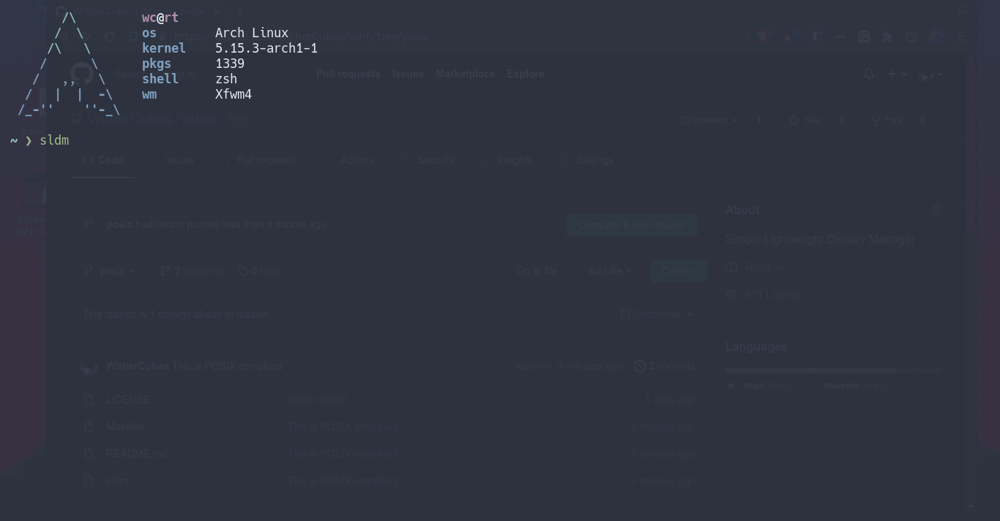

# sldm

A simple display/session manager which is almost POSIX compliant.

This is a project I made with my very little shell scripting knowledge. If you want a lot better, feature rich (Wayland support), minimal display/session manager, use [tbsm](https://github.com/loh-tar/tbsm).

## Dependencies

- dialog
- sed, find, grep, tail, paste, sort (coreutils)
- xorg-xinit

## Installation

    # make install

## Uninstallation

    # make uninstall

## Configuration

- Edit the sldm file and reinstall by following the installation given above.

## Thanks to

- Raph
- Vynast
- DoctorCringePhD
- Humm
- Ulfnic

## License

Released under the [MIT License](LICENSE).
