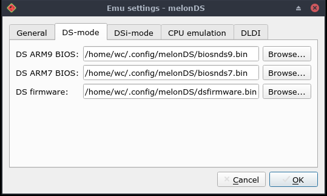
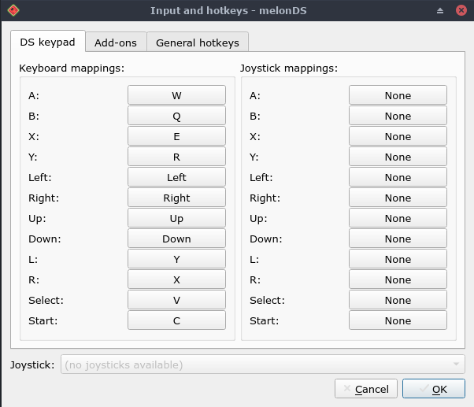
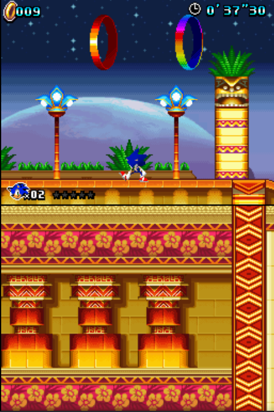
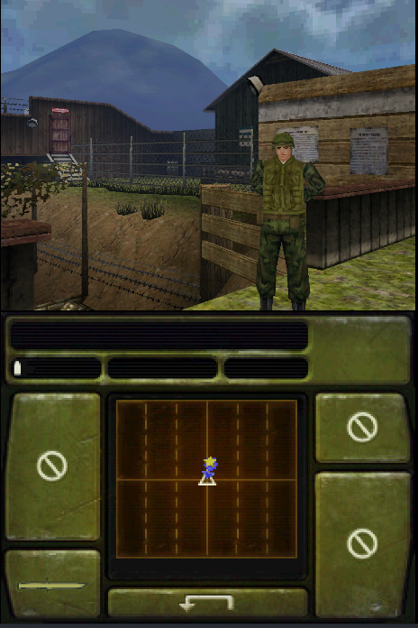

# How to play Nintendo DS games on Linux

This is a quick and dirty tutorial on how to play Nintendo DS games on linux using MelonDS emulator. Back in its prime, the Nintendo DS was one of the most successful hand-held consoles of all time. Unfortunately, that time has passed, and Nintendo doesn’t sell the console in stores anymore. Many people wish to play the old games for entertainment, so let's see how to play Nintendo DS games on linux.

## Install MelonDS

### Snap

`$ sudo snap install melonds`

### Arch Linux (using AUR)

`$ git clone https://aur.archlinux.org/melonds-git.git && cd melonds-git && makepkg -si`

### Other Distributions

- Visit the [MelonDS website](http://melonds.kuribo64.net/downloads.php) and download the latest **Linux x64** version.
- Extract the archive file to /usr/bin or /usr/local/bin.

## Getting Nintendo DS Firmware and Game ROMS

If you have your own dump of Nintendo DS games and firmware, it is well and good, but if you don't have them you can download them from the internet (there are some legal issues). Your best friend for this is archive.org.

- [Nintendo DS firmware](https://archive.org/details/ds-firmware_dsi-nand-and-firmware)
- [Nintendo DS Games](https://r-roms.github.io)
- If you want any other games, you can figure it out yourself.

**Note: I do not condone any piracy, I am just linking to public sources. Download the game ROMS and firmware at your own risk.**

## Setting up MelonDS

First open up melonDS and go to Config → Emu Settings → DS-mode, select your Nintendo DS firmware location respectively and hit OK.

Then the next step is to configure the controls. To do that go to Config → Input and hotkeys → DS keypad and configure your controls according to your needs and hit OK. Here is an example of my controls configuration.

The last basic step to do is to configure the video settings and the screen layout. To adjust the video settings go to Config → Video settings and tweak the setting according to your needs. The screen layout can also be changed by choosing the desired screen layout in the same config menu.

## Start Playing!

Once you have configured MelonDS, its time to start playing. Most of the games work perfectly fine, but you may have issues in some games like framerate issues and audio issues. The solution is to change the internal resolution in video settings.

## Gameplay Screenshots

### Sonic Colors

### Call Of Duty - Black Ops 

